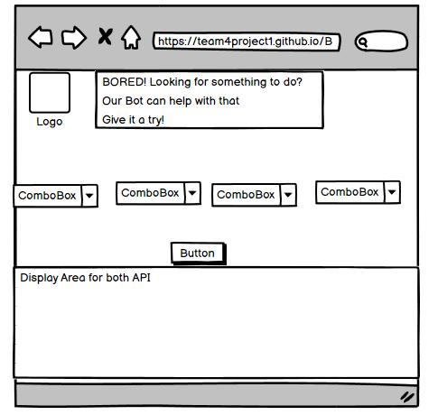
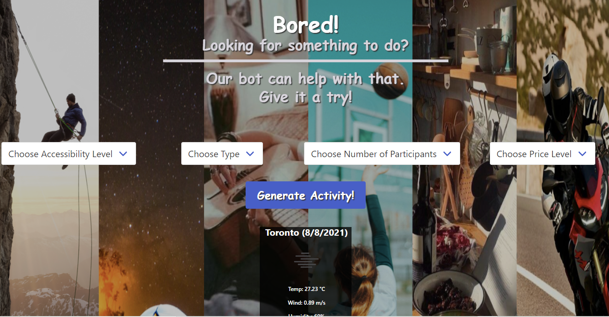

# Team Four Project - Bored!

## The Concept
Create a responsive website that uses two API's, uses local storage and does not use alerts.

Bored! is a random activity generator that uses the Bored API to provide random activities and tells you the weather to plan around your activity. It produces activities that are categorized by type, participants, price, and accessibility. Types include education, recreational, social, DIY, charity, cooking, relaxation, music and busywork. Participants range from 1 - 4 people. Price is on a scale from 1 – 10 where 1 is free and 10 is pricy. Accessibility is on a scale from 0.0 to 1.0 describing how possible the event is to do with zero being the most accessible. Click on the button and an activity is generated.

  
### Thought Process
- The current pandemic makes it difficult to socialize.
- Staying home or being around the same persons leads to boredom
- Bored! being able to provide you with random activities can help cure your boredom and provide the weather to plan around your choosen activity.

### The Idea
- Develop an application that can assist with boredom
- Application that suggest activities
- in a small group or individually.
- Must be accessible
- Must be affordable or free
- Must be engaging 
- Must provide relaxation or enjoyment

### The Vision
- Create application
- Application generates activity
- Participate in activites
- Share images or live videos  
- Invites friends or groups to participant.
- Hence relief from boredom

### The Design 
- Bored API

### TEchnology
- HTML, CSS, JavaScript
- Bulma - for styling
- Jquery
- Prezi - for the presentation
- Github 
- Bored API 
- Open Weather API
- Zoom 
- Slacks
- Google Meets
- Balsamiq - for wire framing 
            
### Initial Layout          

- Balsamiq was used for initial design

### User Story
- AS A person who is bored
- I WANT to use Bored! to find something to do
- SO I go to Bored! to generate an activity that can cure me of my boredom

### Challenges 
- Deciding on the second API
- Social media provides challenges  
- Timeline for project an issues 
- Limited knowledge about API

### Choice
- Second API weather 
- Geo-linked to user 
- Is condition favorable for outdoor activity?
    
### Issues
- Merging branches to github
- Creating group password and email
- Getting user to share location

### Success 
- Dialogue
- sharing ideas 
- team work.
- working MVP

### Snap Shot
This is an image of the projects web-site

### Presention
[Presentation](https://prezi.com/p/aeazqt_q-uga/bored/)

### Project Deployment
[Bored!!!](https://team4project1.github.io/Bored/)

### GitHub Repository Link 
[GitHub](https://github.com/Team4project1/Bored)

## The Team
### Team Members |   Portfolio Link

Charles Dawkins  | [Portfolio](https://dawkc.github.io/Charles-Dawkins-Portfolio/)

Mikhael Hamoy    | [Portfolio](https://github.com/mikhaelhamoy)

Jessica Wu       | [Portfolio](https://github.com/jessibewu)

Abison Vijayakanthan | [Portfolio](https://github.com/akvijaya)

Talha Latif      | [Portfolio](https://github.com/Talha636)

Neil Hall        | [Portfolio](https://jahneo.github.io/Portfolio/)

### Credits and Thanks
* The instructors of the UTOR-Coding-Bootcamp
- Andy Durette
- Hilmi Yildirim
- Edward Apostol
- Ryan Kelley
- The feedback from fellow learners
